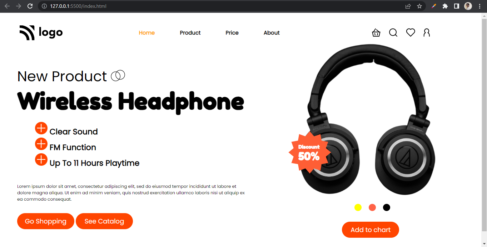

# Assignment 7

## Project 7 [Live Link](https://nachiketkeripaleproject7.netlify.app/)

-  Used flex and position in this project.
-  Used Z-index property in this project.
-  Used Goolge Fonts for this project.
-  Got idea about how we can user z-index to align content front or back.

---

## Time taken to finish this project

-   4 hour to complete it.

#### Screenshot

 

